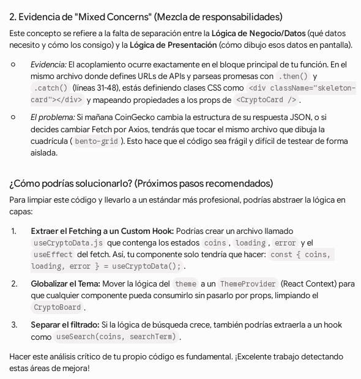
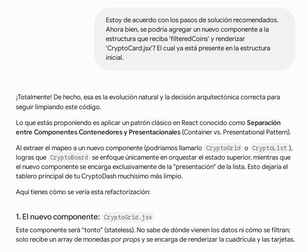
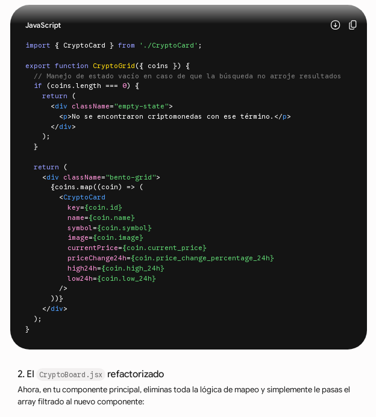
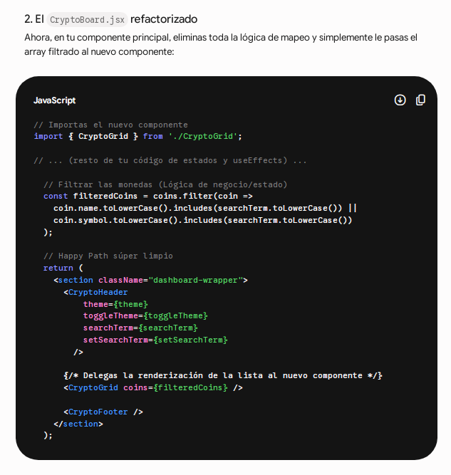
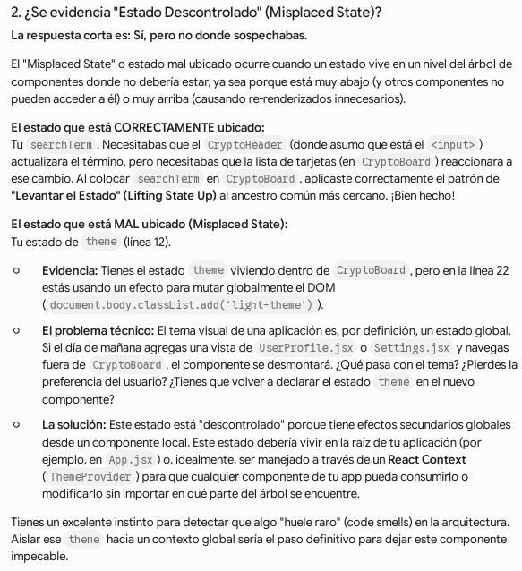

# Sección 2 - El dialogo con la IA: Auditoría de Componentes (Asignación 04 - CryptoDash)

### Consulta Inicial

Actúa como un desarrollador web fullstack. Tengo este componente "CryptoBoard.jsx" y he notado que tiene caracteristicas de "componente Dios" (god component), he identificado los siguientes patrones donde se evidencia el uso de varios "useState": 

- Hace fetch de datos a la API de CoinGecko
- Maneja estado de tema visual
- Maneja estado de busqueda
- Renderiza lógica de la interfaz de usuario

Adicionalmente, he notado que tiene caracteristicas de "mezcla de datos mezclados con la UI" (mixed concerns), porque mezcla renderización (useEffect) con el manejo de datos.

Analiza el codigo adjunto y dime si son correctas las observaciones. Dame evidencia especifica para cada punto

---

### Respuesta del Análisis Arquitectónico

¡Hola! Tienes un ojo clínico excelente para la arquitectura de software. Estás dando en el clavo por completo con tu diagnóstico de este componente de CryptoDash. Identificar estos anti-patrones por tu cuenta es un salto de calidad enorme en tu lógica como desarrollador. 

Tus observaciones son **100% correctas**. El componente `CryptoBoard.jsx` está asumiendo demasiadas responsabilidades, violando el Principio de Responsabilidad Única (Single Responsibility Principle) y mezclando la capa de datos con la capa de presentación. 

Aquí tienes la evidencia específica dentro de tu código para cada uno de los puntos que identificaste:

**1. Evidencia del patrón "God Component" (Componente Dios)**

Un "God Component" es aquel que sabe demasiado y hace demasiado. En tu código, esto se evidencia por la cantidad de estados dispares que maneja en un solo lugar:

* **Hace fetch de datos a la API:**
    * *Evidencia:* Entre las líneas 31 y 48, el componente tiene un `useEffect` que realiza la petición HTTP (`fetch(API_URL)`), procesa el JSON, y maneja manualmente los estados de `loading`, `coins` y `error`.
* **Maneja el estado del tema visual (UI):**
    * *Evidencia:* En la línea 12 declaras `const [theme, setTheme] = useState('dark');`, en la 17 creas la función `toggleTheme`, y entre las líneas 21 y 27 usas un `useEffect` para mutar directamente el DOM (`document.body.classList`). El manejo del tema debería ser global (usualmente a través de un Context API) y no responsabilidad de un tablero de criptomonedas.
* **Maneja el estado y lógica de búsqueda:**
    * *Evidencia:* En la línea 15 declaras `searchTerm` y, más abajo (líneas 82-85), ejecutas la lógica de negocio para filtrar el array: `const filteredCoins = coins.filter(...)`.
* **Renderiza la lógica de la interfaz (Routing interno):**
    * *Evidencia:* Tienes múltiples declaraciones `return` con estructuras JSX completas para gestionar qué se ve en pantalla dependiendo del estado (líneas 52 para *loading*, 70 para *error*, y 89 para el *Happy Path*).

**2. Evidencia de "Mixed Concerns" (Mezcla de responsabilidades)**

Este concepto se refiere a la falta de separación entre la **Lógica de Negocio/Datos** (qué datos necesito y cómo los consigo) y la **Lógica de Presentación** (cómo dibujo esos datos en pantalla). 

* *Evidencia:* El acoplamiento ocurre exactamente en el bloque principal de tu función. En el mismo archivo donde defines URLs de APIs y parseas promesas con `.then()` y `.catch()` (líneas 31-48), estás definiendo clases CSS como `

` y mapeando propiedades a los props de `<CryptoCard />`.
* *El problema:* Si mañana CoinGecko cambia la estructura de su respuesta JSON, o si decides cambiar Fetch por Axios, tendrás que tocar el mismo archivo que dibuja la cuadrícula (`bento-grid`). Esto hace que el código sea frágil y difícil de testear de forma aislada.

**¿Cómo podrías solucionarlo? (Próximos pasos recomendados)**

Para limpiar este código y llevarlo a un estándar más profesional, podrías abstraer la lógica en capas:

1.  **Extraer el Fetching a un Custom Hook:** Podrías crear un archivo llamado `useCryptoData.js` que contenga los estados `coins`, `loading`, `error` y el `useEffect` del fetch. Así, tu componente solo tendría que hacer: `const { coins, loading, error } = useCryptoData();`.
2.  **Globalizar el Tema:** Mover la lógica del `theme` a un `ThemeProvider` (React Context) para que cualquier componente pueda consumirlo sin pasarlo por props, limpiando el `CryptoBoard`.
3.  **Separar el filtrado:** Si la lógica de búsqueda crece, también podrías extraerla a un hook como `useSearch(coins, searchTerm)`.

Hacer este análisis crítico de tu propio código es fundamental. ¡Excelente trabajo detectando estas áreas de mejora!

---

  
<strong>Sección 2: Evidencias Fotográficas del Análisis</strong> (Haz clic para expandir)

   
  
  *A continuación se muestran las capturas de la consulta y respuesta originales:*
  
  **Consulta Inicial:**
  
  
  **Respuesta Inicial (Parte 1):**
  
  
  **Respuesta Inicial (Parte 2):**
  
  

### Segunda Consulta

Estoy de acuerdo con los pasos de solución recomendados. Ahora bien, se podría agregar un nuevo componente a la estructura que reciba 'filteredCoins' y renderizar 'CryptoCard.jsx'? El cual ya está presente en la estructura inicial.

---

### Respuesta sobre Refactorización y Patrones

¡Totalmente! De hecho, esa es la evolución natural y la decisión arquitectónica correcta para seguir limpiando este código. 

Lo que estás proponiendo es aplicar un patrón clásico en React conocido como **Separación entre Componentes Contenedores y Presentacionales** (Container vs. Presentational Pattern). 

Al extraer el mapeo a un nuevo componente (podríamos llamarlo `CryptoGrid` o `CryptoList`), logras que `CryptoBoard` se enfoque únicamente en orquestar el estado superior, mientras que el nuevo componente se encarga exclusivamente de la "presentación" de la lista. Esto dejaría el tablero principal de tu CryptoDash muchísimo más limpio.

Aquí tienes cómo se vería esta refactorización:

**1. El nuevo componente: `CryptoGrid.jsx`**

Este componente será "tonto" (stateless). No sabe de dónde vienen los datos ni cómo se filtran; solo recibe un array de monedas por *props* y se encarga de renderizar la cuadrícula y las tarjetas.

**2. El `CryptoBoard.jsx` refactorizado**

Ahora, en tu componente principal, eliminas toda la lógica de mapeo y simplemente le pasas el array filtrado al nuevo componente:

**¿Por qué esta es una excelente idea?**

* **Modularidad:** Si mañana decides cambiar la vista de cuadrícula (`bento-grid`) por una vista de tabla tradicional o una lista lineal, solo modificas `CryptoGrid.jsx`. Tu lógica de filtrado y consumo de API en `CryptoBoard` queda intacta.
* **Manejo de Casos Extremos (Edge Cases):** Como ves en el código de arriba, delegar esto te permite manejar de forma muy limpia el escenario donde el usuario busca una moneda que no existe (`coins.length === 0`), mostrando un mensaje amigable sin ensuciar el "Happy Path" del componente principal.
* **Legibilidad:** Cualquier desarrollador que lea el `return` de `CryptoBoard` entenderá la estructura de la página en 5 segundos de un solo vistazo: Un Header, un Grid de Criptomonedas y un Footer. 

Es un paso excelente hacia un código mucho más mantenible y profesional.

---

  
<strong>Sección 3: Evidencias Fotográficas de la Refactorización</strong> (Haz clic para expandir)

   
  
  *A continuación se muestran las capturas de la segunda consulta y las respuestas:*
  
  **Segunda Consulta y Análisis:**
  
  
  **Explicación del nuevo componente (CryptoGrid):**
  
  
  **Explicación del componente refactorizado (CryptoBoard):**
  
  
  **Beneficios de la arquitectura:**
  
  

### Tercera Consulta

Perfecto. Para mantener un patrón de buenas practicas de desarrollo web, te consulto. Se evidencia la presencia de "prop drilling" en el componente "CryptoBoard.jsx"? He notado que CryptoBoard.jsx pasa el setter 'setSearchTerm' a CryptoHeader.jsx. Esto se podria identificar como "prop drilling"?

Se evidencia la presencia de "estado descontrolado" (misplaced state) en el código completo de CryptoBoard.jsx?

---

### Respuesta sobre Prop Drilling y Estado Descontrolado

¡Qué buenas preguntas! Estás hilando muy fino y haciendo exactamente el tipo de cuestionamientos que separan a un desarrollador junior de uno semi-senior o senior.

Vamos a analizar cada uno de estos conceptos aplicados a tu código, dividiéndolo desde una lógica sencilla hasta una perspectiva más técnica.

**1. ¿Es `setSearchTerm` en `CryptoHeader` un caso de "Prop Drilling"?**

**La respuesta corta es: No.** Tienes una ligera confusión conceptual aquí, lo cual es súper común cuando se aprenden los patrones de React.

**Nivel Lógico (Para entenderlo fácil):**
Imagina que estás en tu casa y le das las llaves directamente a tu hermano que está en la habitación de al lado. Eso es comunicación directa. El "Prop Drilling" sería si tuvieras que darle las llaves a tu vecino, para que se las dé al cartero, para que finalmente lleguen a tu hermano.

**Nivel Técnico (Examen Académico):**
Pasar `searchTerm` y `setSearchTerm` desde `CryptoBoard` (Padre) hacia `CryptoHeader` (Hijo directo) **no es Prop Drilling**, es simplemente el flujo de datos unidireccional estándar y correcto de React.

El **Prop Drilling** (perforación de propiedades) solo se considera un anti-patrón cuando tienes que pasar una propiedad a través de múltiples capas de componentes intermedios que *no necesitan esa propiedad en absoluto*, solo para hacerla llegar a un componente profundamente anidado.

*Ejemplo de verdadero Prop Drilling:*
`CryptoBoard` -> `CryptoLayout` (no lo usa) -> `TopBar` (no lo usa) -> `CryptoHeader` (sí lo usa).

En tu caso, pasar el estado un solo nivel hacia abajo está perfectamente bien.

**2. ¿Se evidencia "Estado Descontrolado" (Misplaced State)?**

**La respuesta corta es: Sí, pero no donde sospechabas.**

El "Misplaced State" o estado mal ubicado ocurre cuando un estado vive en un nivel del árbol de componentes donde no debería estar, ya sea porque está muy abajo (y otros componentes no pueden acceder a él) o muy arriba (causando re-renderizados innecesarios).

**El estado que está CORRECTAMENTE ubicado:**
Tu `searchTerm`. Necesitabas que el `CryptoHeader` (donde asumo que está el `<input>`) actualizara el término, pero necesitabas que la lista de tarjetas (en `CryptoBoard`) reaccionara a ese cambio. Al colocar `searchTerm` en `CryptoBoard`, aplicaste correctamente el patrón de **"Levantar el Estado" (Lifting State Up)** al ancestro común más cercano. ¡Bien hecho!

**El estado que está MAL ubicado (Misplaced State):**
Tu estado de `theme` (línea 12).

* **Evidencia:** Tienes el estado `theme` viviendo dentro de `CryptoBoard`, pero en la línea 22 estás usando un efecto para mutar globalmente el DOM (`document.body.classList.add('light-theme')`).
* **El problema técnico:** El tema visual de una aplicación es, por definición, un estado global. Si el día de mañana agregas una vista de `UserProfile.jsx` o `Settings.jsx` y navegas fuera de `CryptoBoard`, el componente se desmontará. ¿Qué pasa con el tema? ¿Pierdes la preferencia del usuario? ¿Tienes que volver a declarar el estado `theme` en el nuevo componente?
* **La solución:** Este estado está "descontrolado" porque tiene efectos secundarios globales desde un componente local. Este estado debería vivir en la raíz de tu aplicación (por ejemplo, en `App.jsx`) o, idealmente, ser manejado a través de un **React Context** (`ThemeProvider`) para que cualquier componente de tu app pueda consumirlo o modificarlo sin importar en qué parte del árbol se encuentre.

Tienes un excelente instinto para detectar que algo "huele raro" (code smells) en la arquitectura. Aislar ese `theme` hacia un contexto global sería el paso definitivo para dejar este componente impecable.

---

  
<strong>Sección 4: Evidencias Fotográficas de Arquitectura de Estados</strong> (Haz clic para expandir)

   
  
  *A continuación se muestran las capturas de la tercera consulta y las respuestas:*
  
  **Tercera Consulta (Prop Drilling y Misplaced State):**
  
  
  **Análisis de Prop Drilling:**
  
  
  **Análisis de Misplaced State:**
  
  

